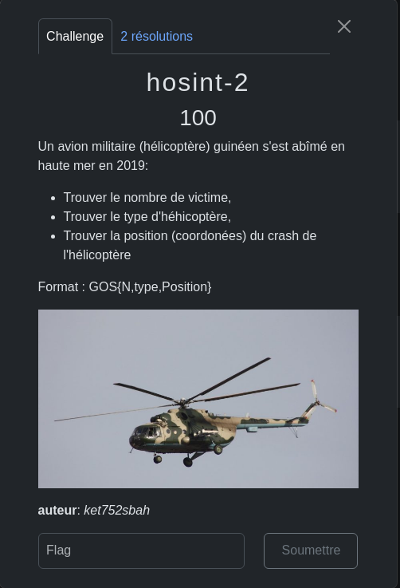
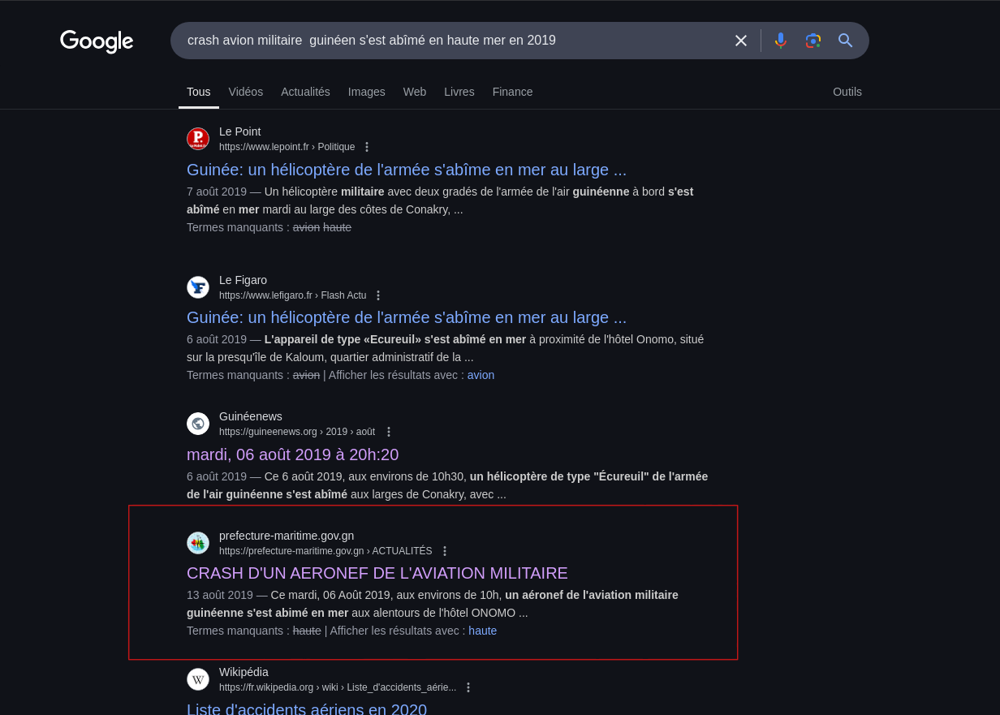
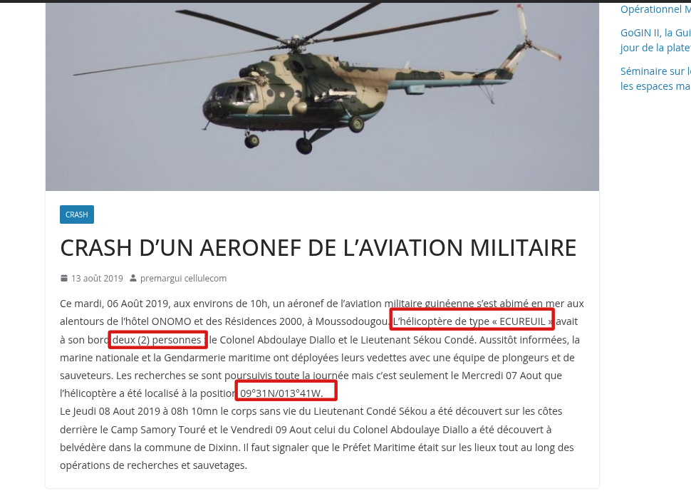
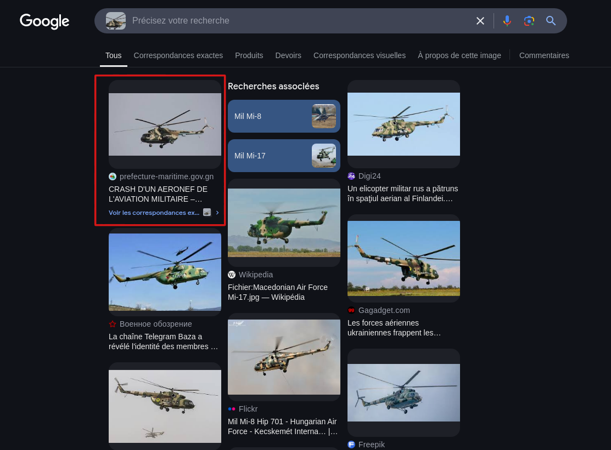
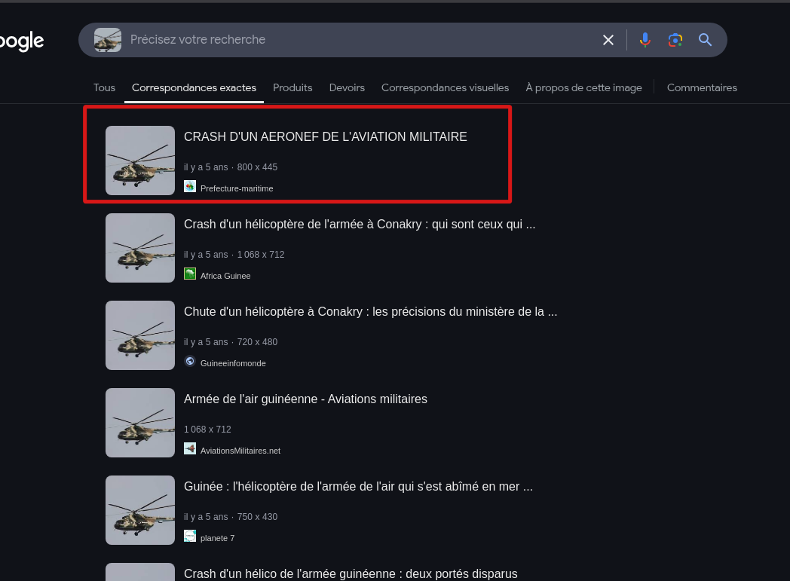

L'objectif de ce challenge est de trouver le nombre de victime du crash le type de l'hélicoptère mais aussi les cordonnées du crash.

### 1er Méthode:

Je peux faire les recherches sur google avec des informations que je detiens l'année du crash 2019 un avion militaire  en guinée, et donc après quelque lecture sur plusieurs plateforme j'obtiens des informations sur le site  prefecture-maritine.gov.gn.

Avec les recheches de ce genre il faut toujours lire.

Type de l'hélicoptère : ECUREUIL

Nombre de Victime: 2 personnes

Position: 09°31N/O13°41W

### 2ème Méthode

Ici je vais utilisé une extension de gogole chrome (RevEye) pour recherche avec une image inversé sans telecharger l'image

Je vérifie la 1er image pour voir si toutes les information que je recheche sont disponible.

Voilà ce qui me donne toujours les même resultats:

Type de l'hélicoptère : ECUREUIL

Nombre de Victime: 2 personnes

Position: 09°31N/O13°41W
