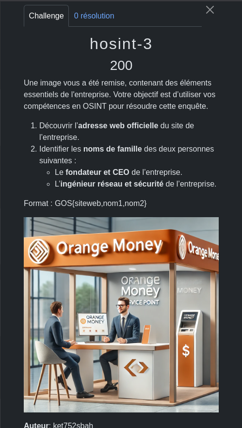
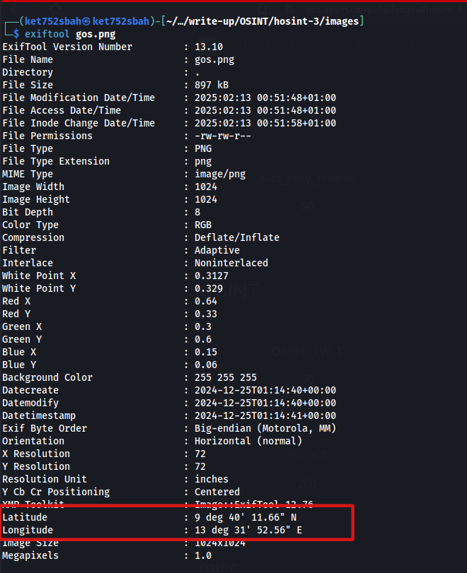
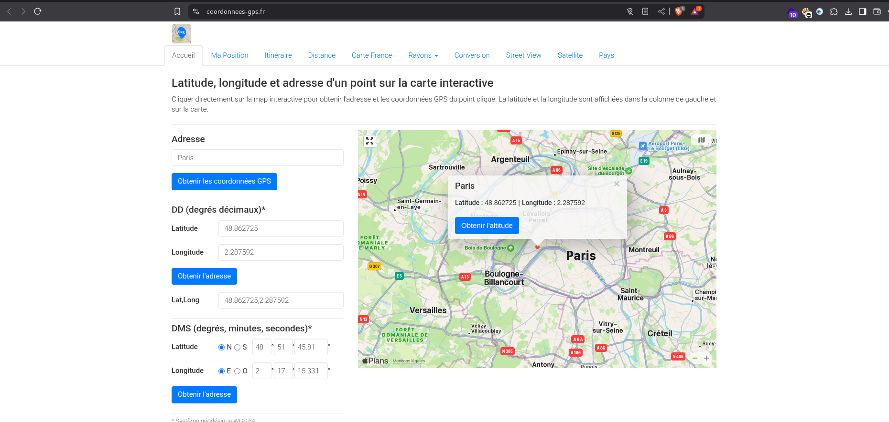
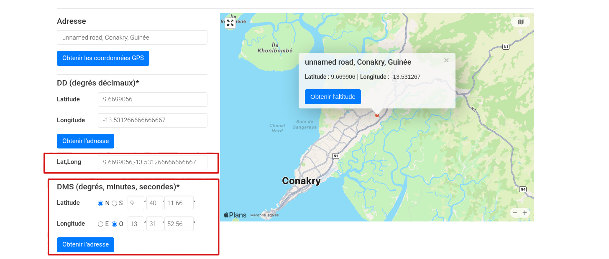
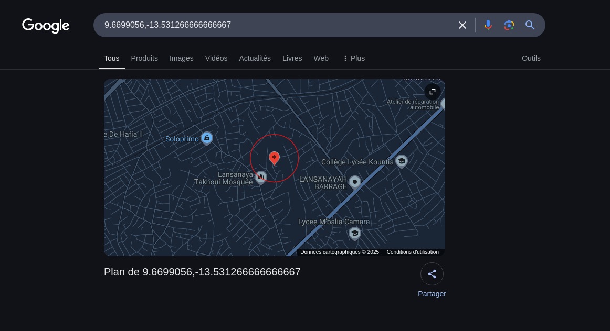
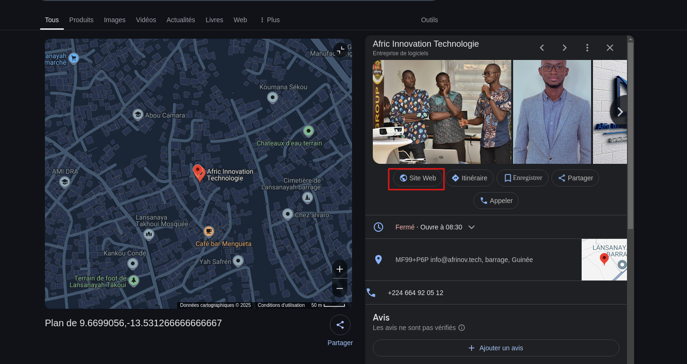
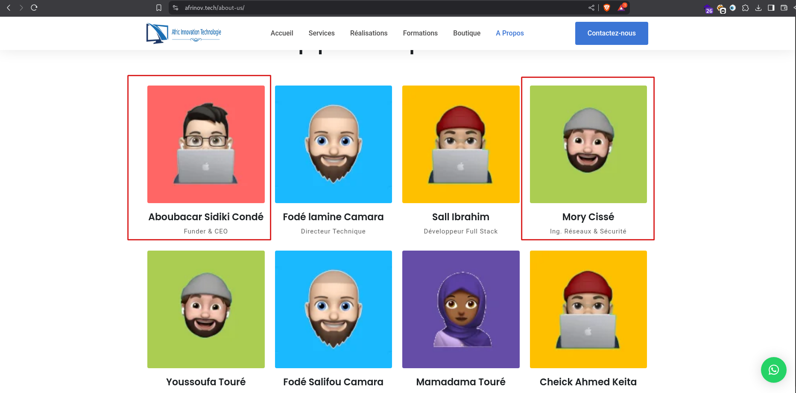

l'objectif de ce challenge est de trouver les information d'un entreprise le site web et identifier le nom de famille du ( Fondateur et CEO )  et (L'ingénieur réseau et sécurité) de l'entrepise.

Du premier vue  l'homme peut pense qu'il s'agit d'orange guinée mais non. nous pouvons aussi faire de recherche sur l'image inverser mais vous n'obtiendrer pas de resultat.

Il faut qu'on analyse les données de l'image voir s'il nous cache pas d'information et ce que je vais faire avec l'outils `exiftool` 



Avec l'outils `Exiftool` je trouve des coordonnées (latitude et longitude) et donc je vais recherche un site web qui va me permetre de trouver les vrais coordonnées ([coordonnees-gps.fr](https://coordonnees-gps.fr)) 



Après avoir un sais les données dans le DMS il falais selectionner Ouest au niveau de la longitude pour avoir les bonne coordonnée et non sur Est



Nous allons rechercher les coordonnées lat,long sur google.



nous avons un point de coordonnée sur l'entreprise donc nous allons rerchercher le site web de l'entreprise qui est `Afric Innovation Technologie` 



Nous allons vérifier le site [afrinove.tech](https://afrinove.tech)


Dans ```A propose```  nous avons les informations du Fondateur & CEO mais aussi de l'ing réseau & Sécurité




NB: c'est dommage de voir que personne n'as trouver ce challenge 😕
