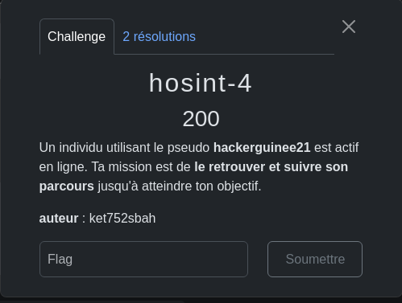
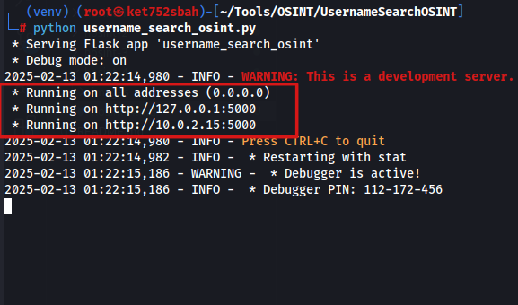
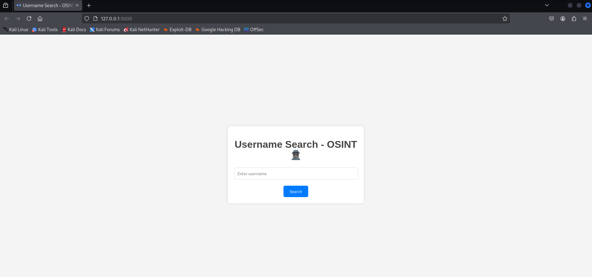
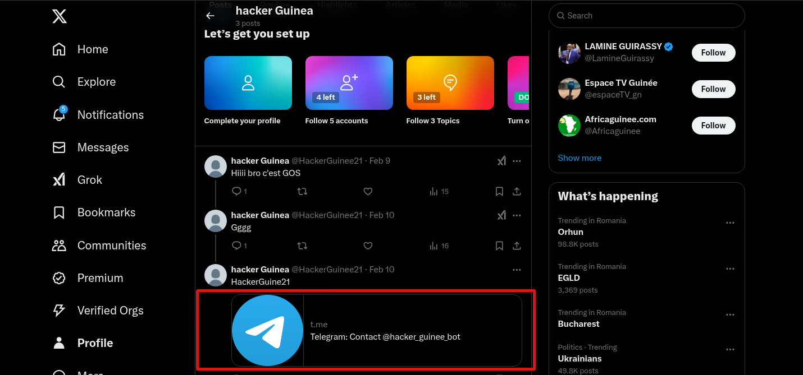

J'ai un utilisateur `hackerguinee21` que je dois rechercher mais voilà j'ai pas d'autre information sauf son pseudo donc je vais utiliser un outils disponbile sur github `https://github.com/HackUnderway/UsernameSearchOSINT` et l'installer sur ma machine et le lancer

Nous avons une interface web que je vais utilisé pour rechercher pseudo de l'utilisateur. 

Et je verifier les resultats qu'il m'a trouver si c'est vrai .

je trouve un compte X (twitter) et je verifier le profile.

je trouver un bot telegram que je vais demarrer voir ce qu'il vas me donner

La commande pour trouver le flag est `/flag` puis il vous envoi le flag en base64 et le décoder 

