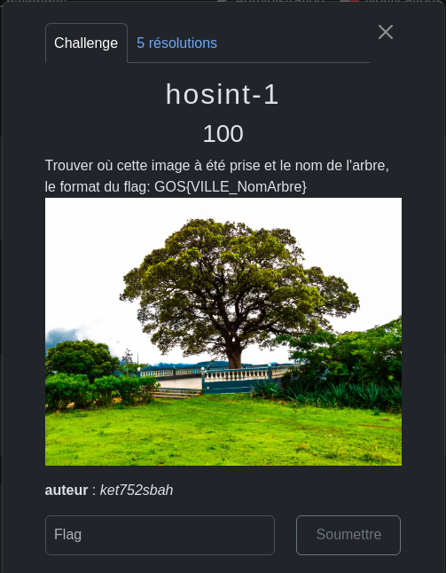
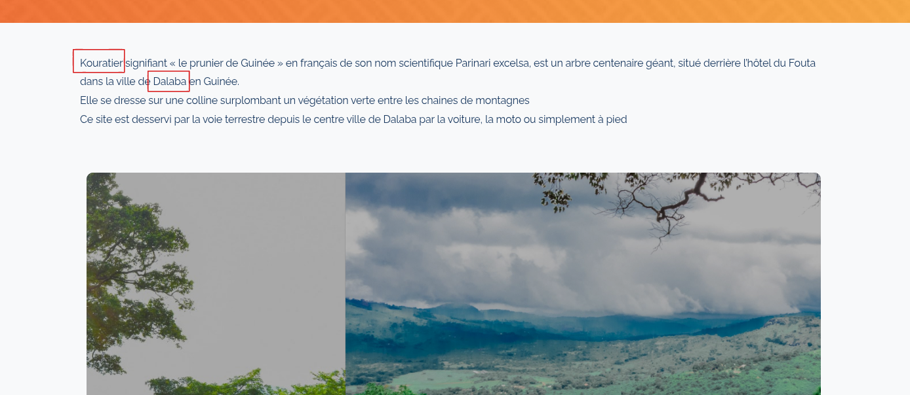

L'objectif de ce challenge est de trouver l'emplacement de l'image et le nom de l'arbre.

La première chose, je vais faire une recherche sur l'image inversée dans google voir si elle est disponible.

Je trouve que l'image de l'Office National du Tourisme est similaire à mon image et donc je clique sur le site, puis je lis les informations du site pour voir s'il y a des informations que je recherche.

Nom de l'arbre : Kouratier

La ville : Dalaba
