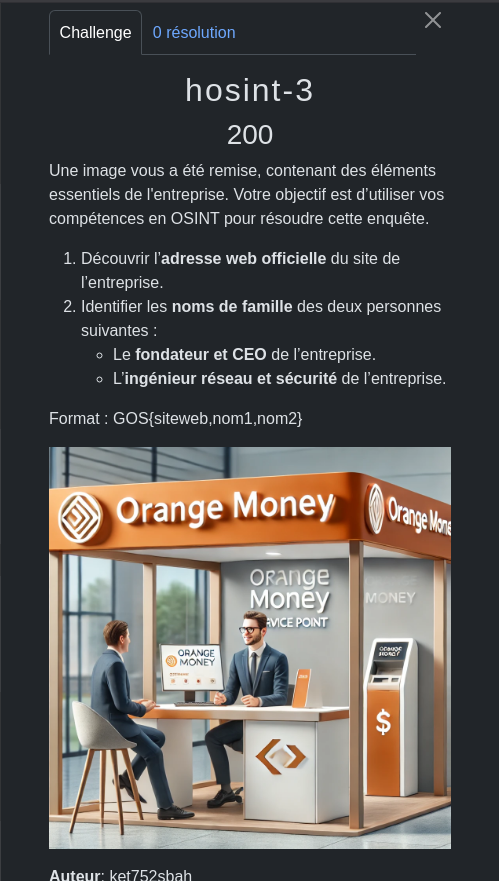
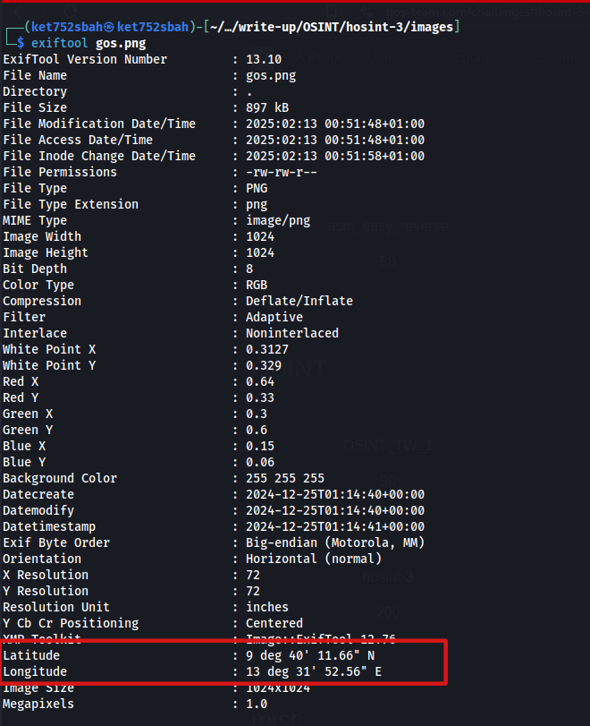
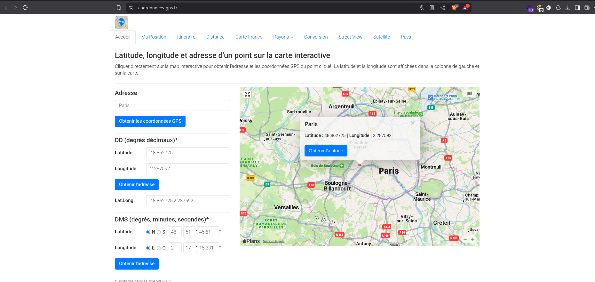
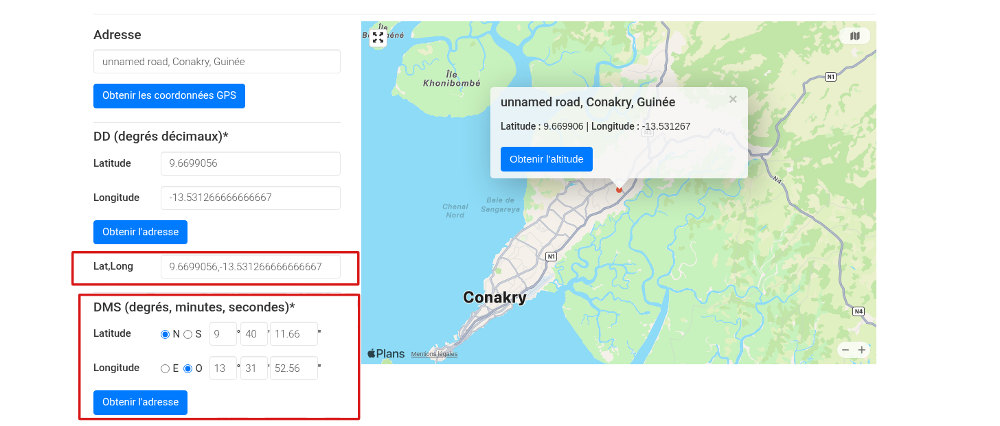
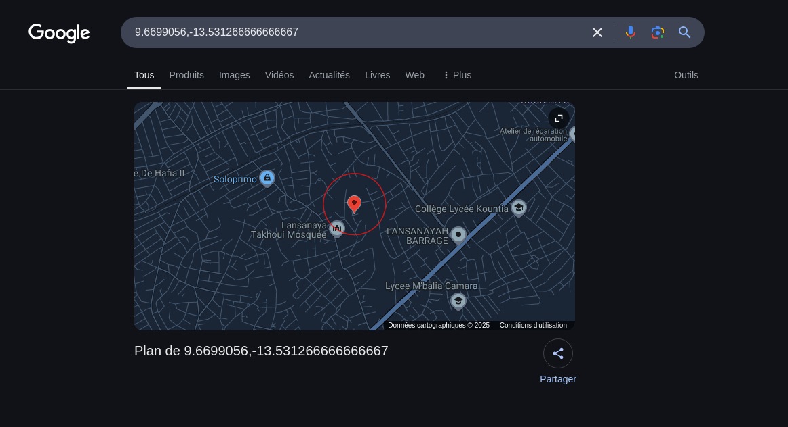
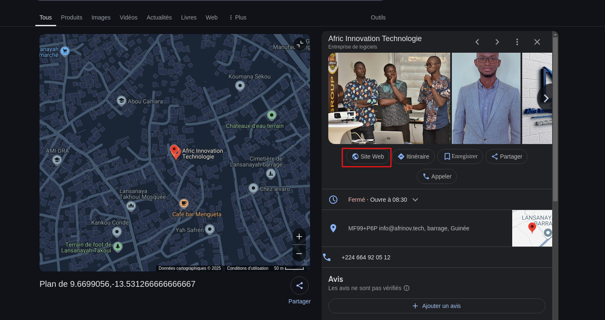
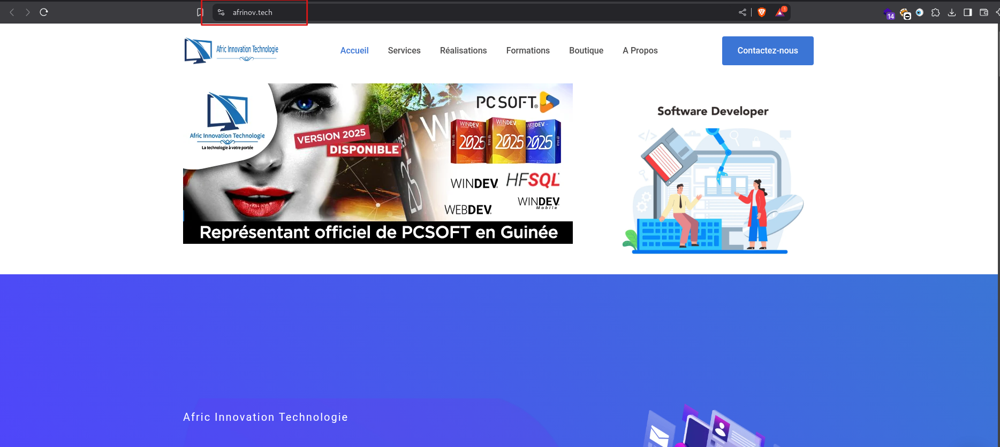
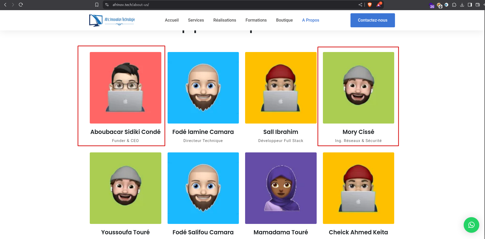

L'objectif de ce challenge est de trouver les informations d'une entreprise sur le site web et d'identifier le nom de famille du ( Fondateur et CEO)  et (L'ingénieur réseau et sécurité) de l'entreprise.

Du premier vue, l'homme peut penser qu'il s'agit d'orange Guinée mais non. Nous pouvons aussi faire des recherches sur l'image inversée mais vous n'obtiendrez pas de résultat.

Il faut qu'on analyse les données de l'image pour voir s'il ne nous cache pas d'informations et ce que je vais faire avec l'outil `exiftool`



**Avec** l'outil `Exiftool`, **je** **trouve** **des** **coordonnées** **(**latitude** **et** **longitude**)** **et** **donc** **je** **vais** **rechercher** **un** **site** **web** **qui** **va** **me** **permettre** **de** **trouver** **les** **vraies** coordonnées ([coordonnees-gps.fr](https://coordonnees-gps.fr))



Après avoir saisi les données dans le DMS, il fallait sélectionner Ouest au niveau de la longitude pour avoir les bonnes coordonnées et non sur Est



Nous allons rechercher les coordonnées lat,long sur google.



nous avons un point de coordonnées sur l'entreprise, donc nous allons rechercher le site web de l'entreprise qui est `Afric Innovation Technologie`



Nous allons vérifier le site [afrinove.tech](https://afrinove.tech)



Dans ```A propose```  nous avons les informations du Fondateur & CEO mais aussi de l'ing réseau & Sécurité



NB: c'est dommage de voir que personne n'a trouvé ce challenge 😕
