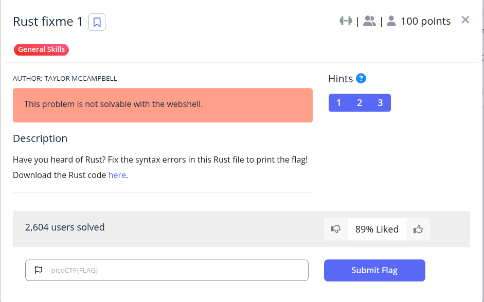
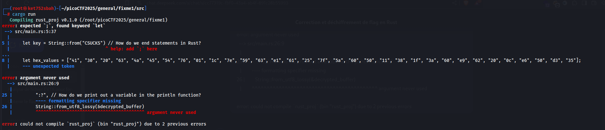
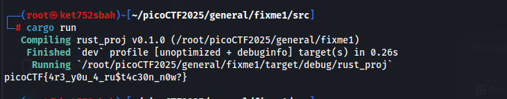

1. **Corriger les erreurs de syntaxe** :
   * Ajouter un point-virgule (`;`) à la fin de la déclaration de la clé.
   * Utiliser `return` au lieu de `ret` pour retourner en cas d'erreur.
   * Utiliser `{}` dans `println!` pour afficher la variable.
2. **Déchiffrer le flag** :
   * Convertir les valeurs hexadécimales en bytes.
   * Utiliser la clé pour déchiffrer les bytes avec un XOR.

```
use xor_cryptor::XORCryptor;

fn main() {
    // Key for decryption
    let key = String::from("CSUCKS"); // Correction: Ajouter un point-virgule

    // Encrypted flag values
    let hex_values = ["41", "30", "20", "63", "4a", "45", "54", "76", "01", "1c", "7e", "59", "63", "e1", "61", "25", "7f", "5a", "60", "50", "11", "38", "1f", "3a", "60", "e9", "62", "20", "0c", "e6", "50", "d3", "35"];

    // Convert the hexadecimal strings to bytes and collect them into a vector
    let encrypted_buffer: Vec<u8> = hex_values.iter()
        .map(|&hex| u8::from_str_radix(hex, 16).unwrap())
        .collect();

    // Create decryption object
    let res = XORCryptor::new(&key);
    if res.is_err() {
        return; // Correction: Utiliser `return` au lieu de `ret`
    }
    let xrc = res.unwrap();

    // Decrypt flag and print it out
    let decrypted_buffer = xrc.decrypt_vec(encrypted_buffer);
    println!(
        "{}", // Correction: Utiliser `{}` pour afficher la variable
        String::from_utf8_lossy(&decrypted_buffer)
    );
}
```




