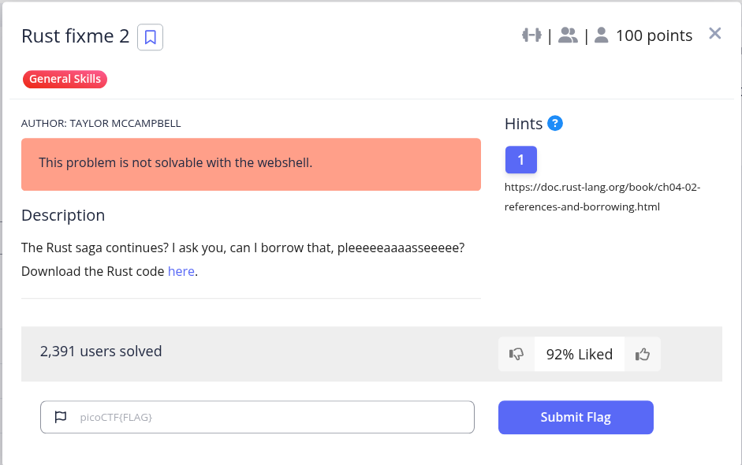

```
use xor_cryptor::XORCryptor;

fn decrypt(encrypted_buffer: Vec<u8>, borrowed_string: &mut String) {
    // Key for decryption
    let key = String::from("CSUCKS");

    // Editing our borrowed value
    borrowed_string.push_str("PARTY FOUL! Here is your flag: ");

    // Create decryption object
    let res = XORCryptor::new(&key);
    if res.is_err() {
        return; // Return early if there's an error
    }
    let xrc = res.unwrap();

    // Decrypt flag and append it to the borrowed string
    let decrypted_buffer = xrc.decrypt_vec(encrypted_buffer);
    borrowed_string.push_str(&String::from_utf8_lossy(&decrypted_buffer));
    println!("{}", borrowed_string);
}

fn main() {
    // Encrypted flag values
    let hex_values = [
        "41", "30", "20", "63", "4a", "45", "54", "76", "01", "1c", "7e", "59", "63", "e1", "61", "25",
        "0d", "c4", "60", "f2", "12", "a0", "18", "03", "51", "03", "36", "05", "0e", "f9", "42", "5b",
    ];

    // Convert the hexadecimal strings to bytes and collect them into a vector
    let encrypted_buffer: Vec<u8> = hex_values
        .iter()
        .map(|&hex| u8::from_str_radix(hex, 16).unwrap())
        .collect();

    let mut party_foul = String::from("Using memory unsafe languages is a: "); // Make this mutable
    decrypt(encrypted_buffer, &mut party_foul); // Pass a mutable reference
}
```


picoCTF{4r3_y0u_h4v1n5_fun_y31?}
