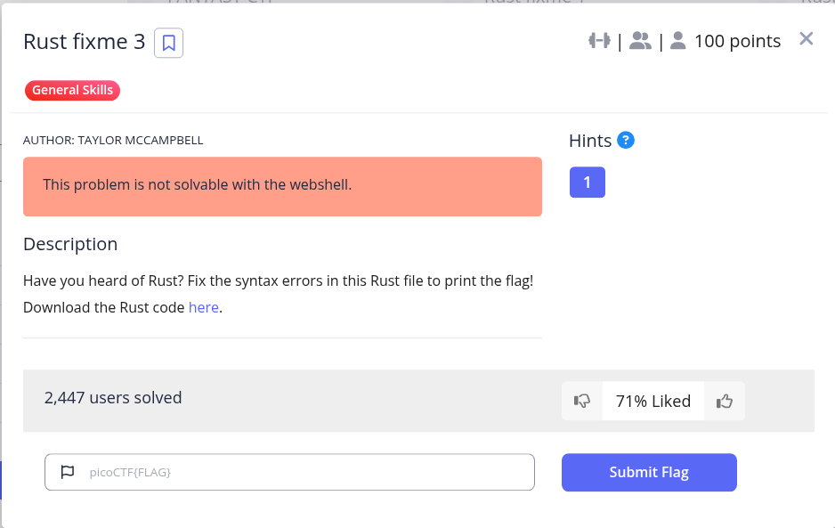
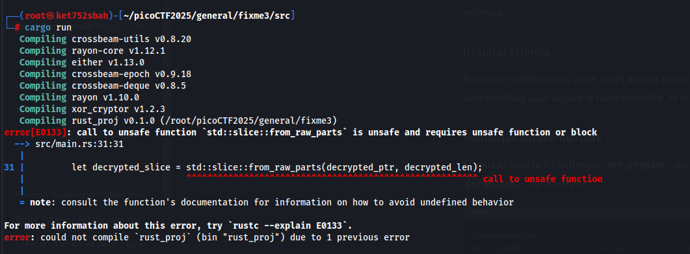
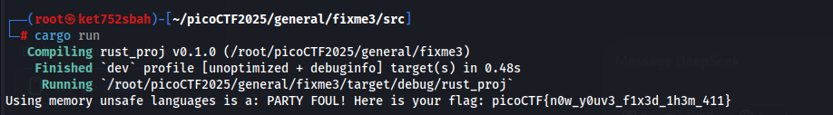

```
use xor_cryptor::XORCryptor;

fn decrypt(encrypted_buffer: Vec<u8>, borrowed_string: &mut String) {
    // Key for decryption
    let key = String::from("CSUCKS");

    // Editing our borrowed value
    borrowed_string.push_str("PARTY FOUL! Here is your flag: ");

    // Create decryption object
    let res = XORCryptor::new(&key);
    if res.is_err() {
        return;
    }
    let xrc = res.unwrap();

    // Decrypt the flag operations
    let decrypted_buffer = xrc.decrypt_vec(encrypted_buffer);

    // Convert the decrypted buffer to a string slice safely
    borrowed_string.push_str(&String::from_utf8_lossy(&decrypted_buffer));

    println!("{}", borrowed_string);
}

fn main() {
    // Encrypted flag values
    let hex_values = [
        "41", "30", "20", "63", "4a", "45", "54", "76", "12", "90", "7e", "53", "63", "e1", "01", "35",
        "7e", "59", "60", "f6", "03", "86", "7f", "56", "41", "29", "30", "6f", "08", "c3", "61", "f9", "35",
    ];

    // Convert the hexadecimal strings to bytes and collect them into a vector
    let encrypted_buffer: Vec<u8> = hex_values
        .iter()
        .map(|&hex| u8::from_str_radix(hex, 16).unwrap())
        .collect();

    let mut party_foul = String::from("Using memory unsafe languages is a: ");
    decrypt(encrypted_buffer, &mut party_foul);
}
```

### Explications des modifications :

1. **Suppression de l'utilisation de `unsafe`** :
   * Vous n'avez pas besoin d'utiliser `std::slice::from_raw_parts` pour accéder au contenu de `decrypted_buffer`. Au lieu de cela, vous pouvez directement utiliser `&decrypted_buffer` pour obtenir un slice (`&[u8]`).
2. **Utilisation de `String::from_utf8_lossy`** :
   * La fonction `String::from_utf8_lossy` prend un slice (`&[u8]`) et le convertit en une chaîne de caractères (`String` ou `Cow<str>`). Cela évite d'avoir à manipuler des pointeurs bruts.
3. **Code plus sûr et plus lisible** :
   * En évitant les blocs `unsafe`, votre code est plus sûr et plus facile à comprendre. Rust encourage l'utilisation de fonctionnalités sûres chaque fois que possible.



picoCTF{n0w_y0uv3_f1x3d_1h3m_411}
