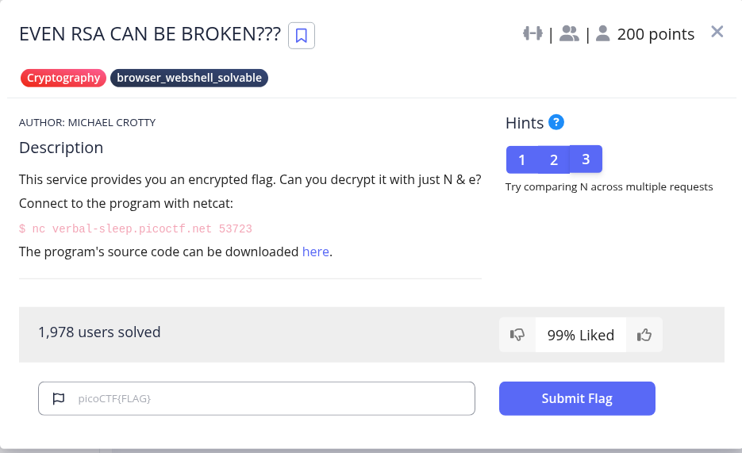
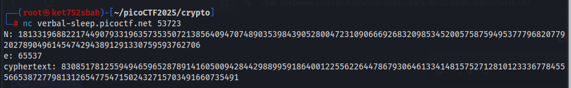
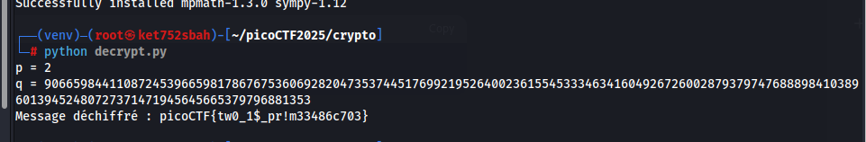

```
from sys import exit
from Crypto.Util.number import bytes_to_long, inverse
from setup import get_primes

e = 65537

def gen_key(k):
    """
    Generates RSA key with k bits
    """
    p,q = get_primes(k//2)
    N = p*q
    d = inverse(e, (p-1)*(q-1))

    return ((N,e), d)

def encrypt(pubkey, m):
    N,e = pubkey
    return pow(bytes_to_long(m.encode('utf-8')), e, N)

def main(flag):
    pubkey, _privkey = gen_key(1024)
    encrypted = encrypt(pubkey, flag) 
    return (pubkey[0], encrypted)

if __name__ == "__main__":
    flag = open('flag.txt', 'r').read()
    flag = flag.strip()
    N, cypher  = main(flag)
    print("N:", N)
    print("e:", e)
    print("cyphertext:", cypher)
    exit()


```



```
from sympy import factorint
from Crypto.Util.number import inverse, long_to_bytes

# Valeurs fournies
N = 18133196882217449079331963573535072138564094707489035398439052800472310906669268320985345200575875949537779682077920278904961454742943891291330759593762706
e = 65537
cyphertext = 8308517812559494659652878914160500942844298899591864001225562264478679306461334148157527128101233367784555665387277981312654775471502432715703491660735491

# Factoriser N
factors = factorint(N)
if len(factors) == 2 and all(e == 1 for e in factors.values()):  # Vérifier que N est bien le produit de deux nombres premiers
    p, q = list(factors.keys())
    print(f"p = {p}")
    print(f"q = {q}")
else:
    raise ValueError("N n'est pas le produit de deux nombres premiers distincts.")

# Vérifier que p * q == N
assert p * q == N, "Erreur : p et q ne sont pas les bons facteurs de N"

# Calculer phi(N)
phi = (p - 1) * (q - 1)

# Calculer d
d = inverse(e, phi)

# Déchiffrer le message
plaintext = long_to_bytes(pow(cyphertext, d, N))

# Afficher le résultat
print("Message déchiffré :", plaintext.decode('utf-8'))
```


