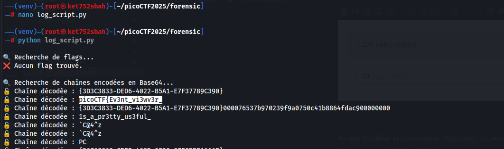
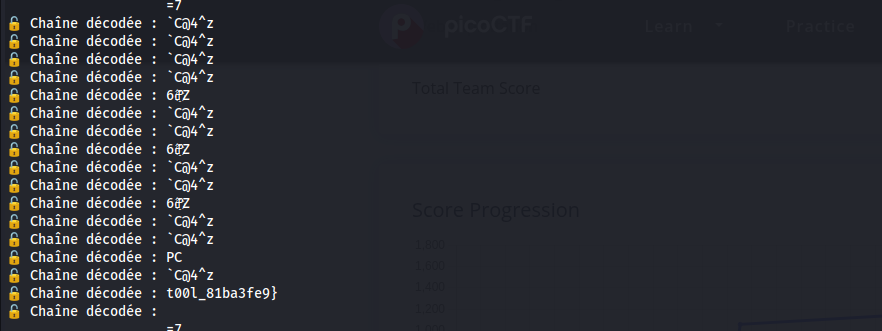

Au lieu d'utiliser la commande `evtx_dump`, tu peux utiliser un script Python pour analyser et extraire les événements du fichier `.evtx`.

Voici comment tu peux le faire :

1. **Installe le package `python-evtx` (si ce n'est pas déjà fait) :**

```
pip install python-evtx
```


2. **Crée un script Python pour extraire les logs :**

Crée un fichier Python, par exemple `extract_evtx.py`

```
from Evtx.Evtx import Evtx
import sys

# Remplacez ce chemin par le chemin de votre fichier .evtx
evtx_file = "Windows_Logs.evtx"
output_file = "logs.txt"

with Evtx(evtx_file) as log:
    with open(output_file, "w") as f:
        for record in log.records():
            f.write(record.xml())
            f.write("\n")

print(f"Les logs ont été extraits dans {output_file}")

```


```
import re
import base64

def read_file(filename):
    """Lit le fichier log et retourne son contenu."""
    with open(filename, "r", encoding="utf-8", errors="ignore") as file:
        return file.readlines()

def find_flags(logs):
    """Recherche un flag de type FLAG{...} ou picoCTF{...}."""
    flag_pattern = re.compile(r"FLAG\{.*?\}|picoCTF\{.*?\}", re.IGNORECASE)
    return [match.group() for line in logs for match in flag_pattern.finditer(line)]

def find_base64_strings(logs):
    """Recherche des chaînes encodées en Base64 et les décode."""
    base64_pattern = re.compile(r"[A-Za-z0-9+/=]{8,}", re.IGNORECASE)
    decoded_strings = []

    for line in logs:
        for match in base64_pattern.finditer(line):
            try:
                decoded = base64.b64decode(match.group()).decode("utf-8")
                decoded_strings.append(decoded)
            except Exception:
                pass  # Ignore les erreurs de décodage

    return decoded_strings

def find_suspicious_events(logs):
    """Recherche des événements suspects comme la suppression de logs."""
    suspicious_patterns = [
        (r"<EventID>1102</EventID>", "🚨 Suppression des logs de sécurité détectée !"),
        (r"<EventID>4624</EventID>", "🔑 Connexion réussie détectée !"),
        (r"<EventID>4672</EventID>", "⚠️ Élévation de privilèges détectée !")
    ]

    findings = []
    for pattern, message in suspicious_patterns:
        if any(re.search(pattern, line) for line in logs):
            findings.append(message)

    return findings

def main():
    filename = "logs.txt"  # Remplace par ton fichier
    logs = read_file(filename)

    print("\n🔍 Recherche de flags...")
    flags = find_flags(logs)
    if flags:
        for flag in flags:
            print(f"✅ Flag trouvé : {flag}")
    else:
        print("❌ Aucun flag trouvé.")

    print("\n🔍 Recherche de chaînes encodées en Base64...")
    decoded_strings = find_base64_strings(logs)
    if decoded_strings:
        for decoded in decoded_strings:
            print(f"🔓 Chaîne décodée : {decoded}")
    else:
        print("❌ Aucune donnée Base64 intéressante trouvée.")

    print("\n🔍 Analyse des événements suspects...")
    suspicious_events = find_suspicious_events(logs)
    if suspicious_events:
        for event in suspicious_events:
            print(event)
    else:
        print("✅ Aucun événement suspect détecté.")

if __name__ == "__main__":
    main()

```






picoCTF{Ev3nt\_vi3wv3r\_1s\_a\_pr3tty\_us3ful\_t00l\_81ba3fe9}
