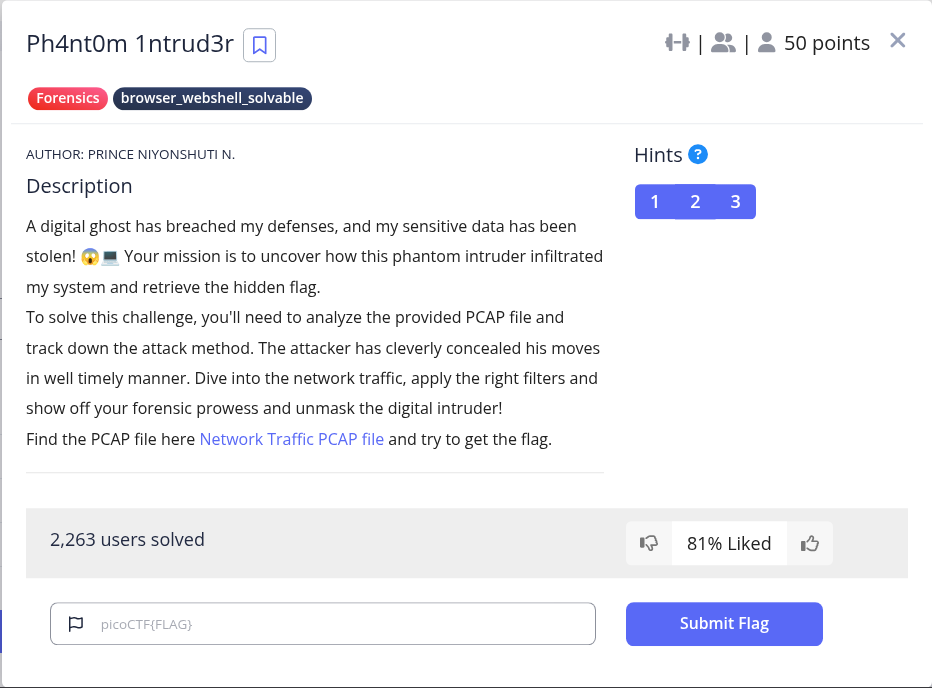

```
import base64

# Liste des chaînes encodées en Base64
encoded_strings = [
    "PRH9csM=",
    "8lu7Yzo=",
    "k7ZdzLM=",
    "HfKh/bI=",
    "gVrnJrc=",
    "633ZLfY=",
    "6WCcDiY=",
    "S14fH84=",
    "e7QUIkk=",
    "V+r2bwA=",
    "WaHbHK8=",
    "/caYdow=",
    "3QyO4x0=",
    "Ctl0bRE=",
    "cGljb0NURg==",
    "ezF0X3c0cw==",
    "bnRfdGg0dA==",
    "XzM0c3lfdA==",
    "YmhfNHJfZA==",
    "NGI1NzkwOQ==",
    "fQ=="
]

# Fonction pour décoder une chaîne Base64 sans afficher les erreurs
def decode_base64(encoded_string):
    try:
        # Décoder la chaîne Base64
        decoded_bytes = base64.b64decode(encoded_string)
        # Convertir les bytes en string
        decoded_string = decoded_bytes.decode('utf-8')
        return decoded_string
    except:
        # En cas d'erreur, retourner une chaîne vide
        return ""

# Décoder toutes les chaînes et les concaténer
flag = ""
for encoded_string in encoded_strings:
    decoded_string = decode_base64(encoded_string)
    flag += decoded_string

# Afficher le flag
print("Flag:", flag)
```

Flag: picoCTF{1t_w4snt_th4t_34sy_tbh_4r_d4b57909}
